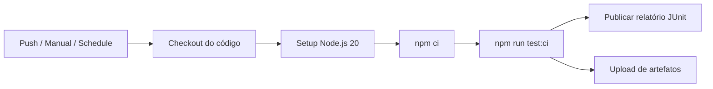

# Onde Assistir API

API REST em Node.js (JavaScript) com Express, autenticação JWT e MongoDB.

## Requisitos

- Node.js 18+ (recomendado 20+)
- MongoDB (local ou remoto)

## Setup

1. Instale dependências

```bash
npm install
```

2. Crie o arquivo `.env` (baseado no exemplo)

```bash
copy .env.example .env
```

3. Ajuste as variáveis no `.env` (principalmente `MONGODB_URI`, `JWT_SECRET` e `TMDB_API_KEY`)

### TMDB (busca de filmes e séries)

A busca usa a [API do TMDB](https://developer.themoviedb.org/docs) — a base mais usada do setor para metadados de filmes/séries. Os dados de **onde assistir** vêm da parceria TMDB + JustWatch (por região, padrão `BR`).

O TMDB **não é um catálogo oficial universal**: cobre a maior parte do conteúdo mainstream, mas pode faltar títulos muito novos, regionais ou obscuros.

1. Crie uma conta em [themoviedb.org](https://www.themoviedb.org/signup)
2. Em **Settings → API**, solicite uma API Key (plano gratuito)
3. Cole em `TMDB_API_KEY` no `.env`

Variáveis opcionais: `TMDB_REGION` (padrão `BR`), `TMDB_LANGUAGE` (padrão `pt-BR`).

4. *(Opcional)* Popule dados locais de exemplo no MongoDB:

```bash
npm run seed
```

O seed insere 30 títulos locais no MongoDB. **A busca do app usa o TMDB**, não essa coleção — o seed é só referência/legado.

## Rodando

- **Modo estático**

```bash
npm start
```

- **Modo desenvolvimento (auto-reload)**

```bash
npm run dev
```

Com o servidor no ar, o front-end estático fica disponível em `http://localhost:3000/` (pasta `frontend/` na raiz do repositório).

## Front-end

Front-end básico em HTML/CSS/JS puro na pasta `frontend/` (um nível acima deste diretório).

### Opção A — recomendada (mesmo servidor)

1. Suba a API com `npm run dev` dentro de `onde-assistir/`
2. Acesse `http://localhost:3000/login.html`

O Express serve os arquivos estáticos automaticamente.

### Opção B — servidor estático separado

```bash
npx serve ../frontend -p 5500
```

Nesse caso, altere `API_BASE` em `frontend/js/config.js` para `http://localhost:3000/api` (CORS já permite origens externas).

## Testes

```bash
npm test
```

Para simular a execução da pipeline localmente (com cobertura e relatório JUnit):

```bash
# Linux/macOS
CI=true npm run test:ci

# Windows PowerShell
$env:CI='true'; npm run test:ci
```

O relatório XML é gerado em `reports/junit.xml` quando `CI=true`.

## Integração Contínua (GitHub Actions)

Este projeto utiliza **GitHub Actions** para automatizar a execução dos testes. A pipeline está definida em [`.github/workflows/ci.yml`](.github/workflows/ci.yml).

**Repositório:** https://github.com/JulianaBatista0807/onde-assistir

### O que é Integração Contínua (CI)?

**Integração Contínua** é a prática de integrar alterações de código com frequência e validar cada integração com testes automatizados. O objetivo é detectar erros cedo, manter o código sempre em estado deployável e dar feedback rápido ao desenvolvedor.

Neste projeto, a CI executa a suíte **Jest** (testes unitários de autenticação, validação e busca TMDB) a cada alteração relevante no repositório.

### Gatilhos (triggers) da pipeline

| Gatilho | Evento | Quando executa |
|---------|--------|----------------|
| **Push** | `push` | Ao enviar commits para `main`, `master` ou branches `feat/**` |
| **Manual** | `workflow_dispatch` | Quando o usuário clica em **Run workflow** na aba Actions do GitHub |
| **Agendado** | `schedule` | Toda segunda-feira às 06:00 UTC (`0 6 * * 1`) |

### Fluxo da pipeline



1. **Checkout** — baixa o código do repositório.
2. **Setup Node.js** — instala Node 20 com cache de dependências (`npm ci`).
3. **Testes** — roda `npm run test:ci` (Jest com `--ci`, cobertura e relatório JUnit).
4. **Publicação** — envia o resultado para **GitHub Checks** via `publish-unit-test-result-action`.
5. **Artefatos** — armazena `reports/junit.xml` e pasta `coverage/` por 30 dias.

### Relatório de testes

- **Formato:** JUnit XML gerado pelo pacote `jest-junit`.
- **Local na pipeline:** artefato `test-report-<número da execução>` (baixável na aba Actions → run → Artifacts).
- **Visualização no GitHub:** aba **Checks** de cada commit/PR mostra pass/fail por suite de teste.

### Variáveis de ambiente na CI

Os testes usam mocks e **não precisam** de MongoDB ou TMDB reais. A pipeline define valores fictícios:

- `MONGODB_URI`, `JWT_SECRET`, `TMDB_API_KEY` — placeholders para carregar módulos sem `.env` local.

### Como executar manualmente

1. Acesse **Actions** no GitHub.
2. Selecione o workflow **CI**.
3. Clique em **Run workflow** → **Run workflow**.

### Evidência de execução bem-sucedida

Após o push desta configuração:

1. Abra **Actions** → workflow **CI** → execução com status verde (✓).
2. Capture screenshot ou copie a URL da run (ex.: `https://github.com/JulianaBatista0807/onde-assistir/actions/runs/<id>`).
3. Opcional: baixe o artefato **test-report-*** com o `junit.xml`.

### Conceitos aplicados

- **Pipeline as Code** — workflow versionado em YAML no repositório.
- **Fail fast** — pipeline falha se algum teste falhar.
- **Artefatos** — relatórios persistidos além do log efêmero do job.
- **Concurrency** — execuções concorrentes na mesma branch cancelam a anterior (`cancel-in-progress`).
- **Ambiente reprodutível** — `npm ci` garante instalação idêntica ao `package-lock.json`.

## Endpoints

- `GET /api/health`
- `POST /api/auth/register`
- `POST /api/auth/login`
- `GET /api/users/me` (Bearer token)
- `GET /api/titles/search?q=matrix&type=movie` (Bearer token)

### Busca de títulos (TMDB)

- **Query params**: `q` (obrigatório, min. 2 caracteres), `type` (`movie` ou `series`, opcional), `limit` (opcional, máx. 20)
- **200**: retorna `{ query, total, region, source: "tmdb", results }` com poster, sinopse e plataformas no Brasil
- Requer `TMDB_API_KEY` configurada

### Login

- **200**: retorna `accessToken` e `expiresAt` (ISO 8601)

## Swagger

- UI: `/docs`
- JSON: `/docs.json`

## Estrutura de pastas

**Backend** (`onde-assistir/`):

- `src/routes`
- `src/middleware`
- `src/controllers`
- `src/models` (User, Title)
- `src/services`
- `scripts/seedTitles.js`

**Front-end** (`frontend/` na raiz do repositório):

- `login.html`, `register.html`, `home.html`
- `css/`, `js/`

